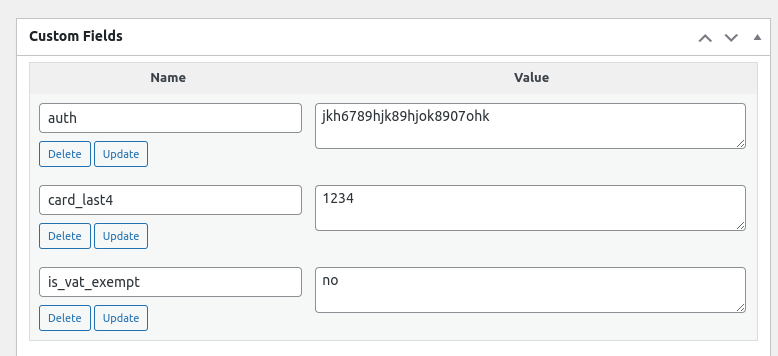

PinkCrab WC Debug Gateways

A collection of payment gateways which can be used for testing and development. These gateways are not intended for production use and should not be used in a live environment.

> Please note these work with both `legacy` and `block` gateways.

# Included Gateways

## Always Confirm

This gateway will always confirm the payment, regardless of the data sent to it.

* Gateway ID: `pc_always_confirm`

This allows the adding of meta data to the order to test the handling of the data. This can be added as key value pairs where the payment form is usually rendered.

|Block|Legacy|
| --- | --- |
|  |  |

## Always Reject

This gateway will always reject the payment, regardless of the data sent to it.

* Gateway ID: `pc_always_reject`

> When being used in the block gateway, you get the choice of to reject via server side or client side.
